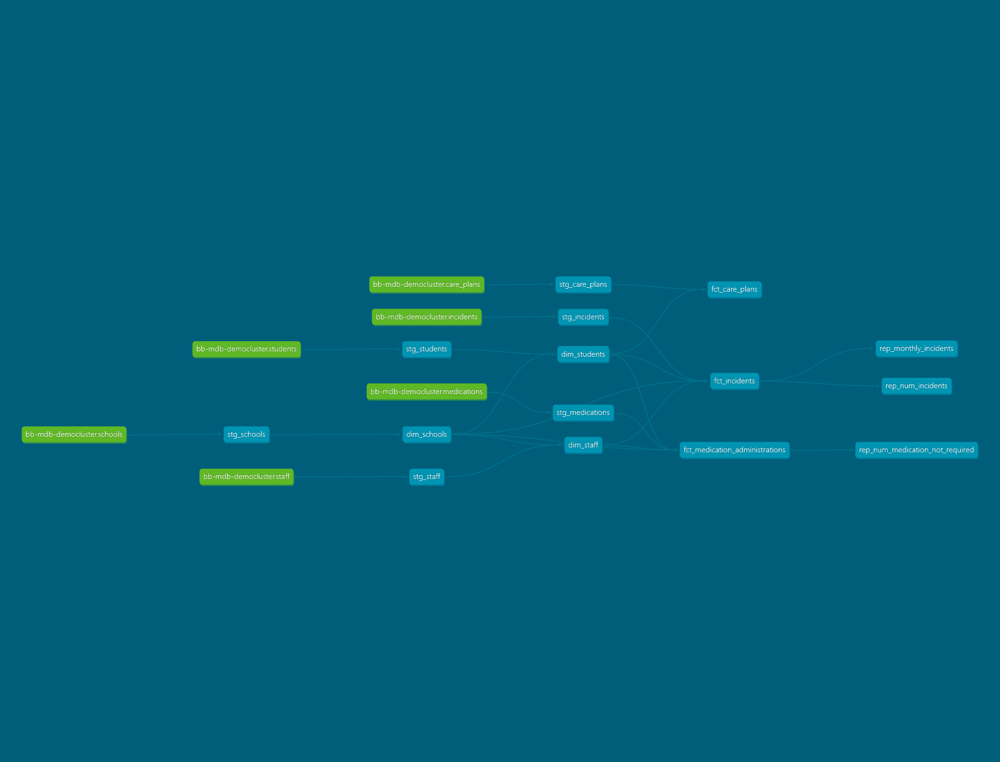

# mongodb-s3-dbt-duckdb


An end-to-end data engineering pipeline built to demonstrate a modern, serverless ELT workflow: **MongoDB Atlas → AWS Glue → Amazon S3 → dbt/DuckDB**, transforming raw NoSQL data into a curated, analytics-ready star schema.

The demo dataset models a school health & safeguarding system: schools, students, staff, medications, incidents, and care plans.



## What this project demonstrates

- **Cloud data integration** — extracting from a NoSQL source (MongoDB Atlas) into cloud object storage (S3) using AWS Glue, including hands-on resolution of VPC networking, IAM permissions, and connection configuration issues typical of real AWS environments.
- **Dimensional modeling** — designing a conformed star schema (fact and dimension tables with surrogate keys) from denormalized document data, applying standard data warehousing patterns (grain definition, conformed dimensions, foreign key integrity).
- **Modern transformation tooling** — using dbt for modular, tested, version-controlled SQL transformations, layered as staging → marts, following dbt's recommended project structure and naming conventions.
- **Serverless analytics engineering** — using DuckDB as a lightweight, zero-infrastructure query engine capable of reading/writing Parquet directly from S3, with a clear path to swap in a production warehouse (Athena, Redshift, Snowflake) without rewriting model logic.
- **Practical troubleshooting** — the pipeline was built and debugged end-to-end, including diagnosing AWS Glue connection failures, IAM/S3 permission issues, and dbt-adapter-specific quirks (see [Known Issues](#known-issues--lessons-learned) below).

---

# Technology Stack

| Technology | Role |
|---|---|
| **Python** | Data generation and pipeline orchestration |
| **Faker** | Synthetic operational data generation |
| **MongoDB** | Operational/document database |
| **PyMongo** | MongoDB connectivity |
| **Amazon S3** | Cloud object storage / data lake |
| **DuckDB** | Analytical query engine |
| **dbt Core** | SQL transformation and data modelling |
| **dbt-duckdb** | dbt adapter for DuckDB |
| **SQL** | Data transformation and analytical modelling |
| **YAML** | dbt configuration, sources and tests |
| **Git** | Version control |

---

## Architecture

```
MongoDB Atlas                AWS Glue (PySpark)              Amazon S3                    dbt + DuckDB
┌───────────────┐          ┌──────────────────────┐        ┌──────────────────┐         ┌─────────────────────┐
│ bb_cdw_demo DB │ ───────▶ │ Visual/Script ETL job │ ─────▶ │ raw/<collection>/ │ ──────▶ │ staging → marts      │
│ 6 collections  │  read    │ reads all collections │  write │ *.parquet          │  read   │ (dim_*, fct_*)       │
└───────────────┘          └──────────────────────┘        └──────────────────┘         └─────────┬───────────┘
                                                                                                     │ write (external)
                                                                                                     ▼
                                                                                          ┌──────────────────────┐
                                                                                          │ curated/<model>/     │
                                                                                          │ *.parquet             │
                                                                                          └──────────────────────┘
```

**Why this stack:** AWS Glue handles Extract + Load (MongoDB → S3, no infrastructure to manage), while dbt + DuckDB handles Transform entirely locally against the S3 Parquet files — no Athena, Redshift, or warehouse cluster needed for local development, with a straightforward path to swap in a production engine later.

---

## Repository structure

```
.
├── raw_data_creation/       # Scripts to generate/seed demo data into MongoDB Atlas
├── data_transformation/     # dbt project (DuckDB adapter)
│   └── bb_demo_dwh/
│       ├── models/
│       │   ├── staging/     # 1:1 cleaned models per raw source table
│       │   │   └── school_health/
│       │   └── datamart/
│       │       ├── core/    # dim_* and fct_* star schema models
│       │       └── reports/ # aggregated reporting models (e.g. monthly incident rollups)
│       ├── dbt_project.yml
│       └── ...
├── requirements.txt          # Python dependencies (pymongo, boto3, duckdb, dbt-duckdb, etc.)
└── .gitignore
```

---

## Data model

Raw MongoDB collections are landed to S3 as-is, then reshaped into a conformed star schema:

| Table | Type | Grain |
|---|---|---|
| `dim_schools` | Dimension | One row per school |
| `dim_students` | Dimension | One row per student |
| `dim_staff` | Dimension | One row per staff member |
| `fct_incidents` | Fact | One row per reported incident |
| `fct_medication_administrations` | Fact | One row per medication record |
| `fct_care_plans` | Fact | One row per student care plan |

Fact tables join to dimensions via generated surrogate keys (`{{ dbt_utils.generate_surrogate_key(...) }}`), keeping natural IDs from the source system alongside them for traceability.

---

## Prerequisites

- Python 3.9+
- An AWS account with:
  - An S3 bucket for raw and curated data
  - An AWS Glue connection configured for MongoDB Atlas
  - IAM credentials with S3 read/write access
- A MongoDB Atlas cluster (SCRAM-authenticated database user)
- AWS CLI installed and configured (`aws configure`)

---

## Setup

1. **Clone the repo and install dependencies**
   ```bash
   git clone https://github.com/blosher13/demo-mongodb-s3-dbt-duckdb.git
   cd demo-mongodb-s3-dbt-duckdb
   pip install -r requirements.txt
   ```

2. **Seed demo data into MongoDB Atlas**
   ```bash
   cd raw_data_creation
   python <seed_script>.py
   ```

3. **Configure AWS credentials**
   ```bash
   aws configure
   aws sts get-caller-identity   # verify
   ```

4. **Run the AWS Glue ETL job** (MongoDB Atlas → S3, one Parquet file per collection under `raw/<collection>/`)
   - Deploy the Glue script from `data_transformation/glue/` (or via the Glue Studio visual editor, using a MongoDB Atlas connection)
   - Confirm output in S3:
     ```bash
     aws s3 ls s3://<your-bucket>/raw/ --recursive
     ```

5. **Configure dbt**

   In `~/.dbt/profiles.yml`:
   ```yaml
   bb_demo_dwh:
     target: dev
     outputs:
       dev:
         type: duckdb
         path: care_plans.duckdb
         extensions: [httpfs, aws]
         settings:
           s3_region: us-east-2
   ```

   In `data_transformation/bb_demo_dwh/dbt_project.yml`, ensure AWS credentials load automatically:
   ```yaml
   on-run-start:
     - "CALL load_aws_credentials();"
   ```

6. **Update source paths**

   In `models/staging/school_health/_school_health__sources.yml`, point `external_location` at your bucket:
   ```yaml
   sources:
     - name: bb-mdb-democluster
       meta:
         external_location: "s3://<your-bucket>/raw/{name}/*.parquet"
       tables:
         - name: schools
         - name: students
         - name: staff
         - name: medications
         - name: incidents
         - name: care_plans
   ```

7. **Run dbt**
   ```bash
   cd data_transformation/bb_demo_dwh
   dbt deps
   dbt run
   ```

   This builds the staging layer, the dimension and fact models, and any downstream reporting models — each mart model writes its output as Parquet directly to `s3://<your-bucket>/curated/<model_name>/<model_name>.parquet` via dbt-duckdb's `external` materialization.

8. **Inspect results**
   ```bash
   dbt show --select dim_schools
   aws s3 ls s3://<your-bucket>/curated/ --recursive
   ```

---

## Key design decisions

- **DuckDB over Athena/Redshift for local dev** — zero infrastructure, queries S3 Parquet directly via the `httpfs`/`aws` extensions, and swaps out for a production warehouse later without changing model SQL.
- **`external` materialization for output** — dim/fact models write straight back to S3 as Parquet, keeping the curated layer in the same object storage as the raw layer rather than trapped inside a local `.duckdb` file.
- **Surrogate keys throughout** — every dimension and fact uses a generated hash key (`dbt_utils.generate_surrogate_key`) rather than relying on raw MongoDB `_id` values, keeping the model portable if source IDs ever change format.
- **Sources declared centrally** — all raw S3 paths live in one `_school_health__sources.yml` rather than being hardcoded per model, so a bucket or path change is a one-line edit.

---

## Known issues & lessons learned

Real problems encountered and resolved while building this pipeline:

| Issue | Root cause | Fix |
|---|---|---|
| Glue `InvalidInputException: Unable to resolve any valid connection` | Connection had a VPC/subnet attached without a route to S3 or the internet | Removed the VPC/subnet from the connection (public Atlas access doesn't require one), or alternatively add a NAT Gateway + S3 Gateway Endpoint |
| DuckDB `HTTP 403 Forbidden` reading S3 | No AWS credentials available to the DuckDB session | Added `CALL load_aws_credentials();` as a dbt `on-run-start` hook so the local AWS CLI session's credentials load automatically |
| dbt `external` materialization wrote empty-looking folders | `location` ended in a trailing `/` with no filename, producing a malformed S3 key | Set `location` to a full file path ending in `<model_name>.parquet` |
| `{name}` templating silently not substituted in output paths | `{name}` placeholder is only supported in `sources.yml` `meta.external_location`, not in `dbt_project.yml` model config | Hardcoded explicit `location` per model instead of relying on templating |

## Notes

- `external` materialization `location` paths in dbt-duckdb must be **static, fully-qualified file paths** — no `{name}` templating is supported outside of `sources.yml`.
